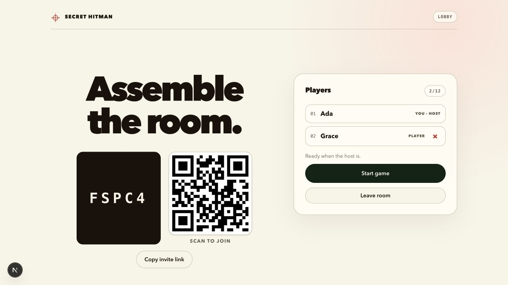
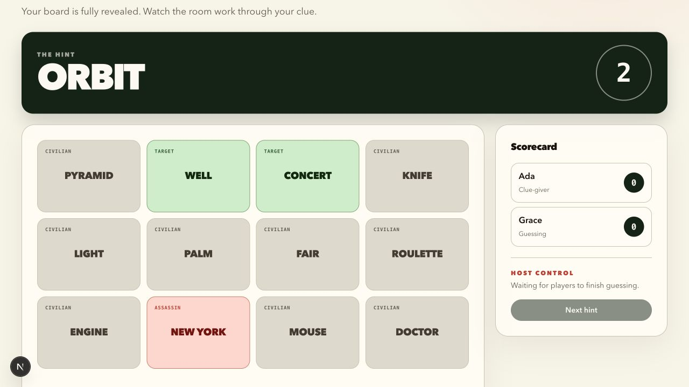
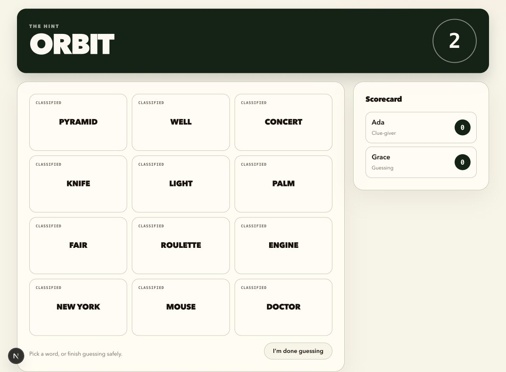
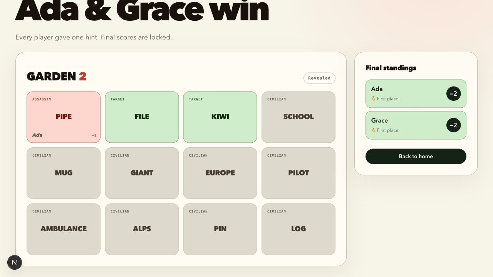

# Spectator experience and host-succession audit

Audited on August 31, 2026 against the pre-implementation `main` baseline for
issues [#4](https://github.com/virakngauv/secret-hitman-5/issues/4) and
[#40](https://github.com/virakngauv/secret-hitman-5/issues/40).

## Outcome

The existing spectator boundary is sound in the scenarios exercised. A
spectator receives no clue-building board, no unrevealed card roles, and no
guess/pass actions. Joining, reconnecting, opening another socket with the same
identity, and a transport disconnect do not transfer host authority.

A spectator can become host, but only through the room's explicit succession
path after the current host and every earlier active member have voluntarily
left. The resulting spectator-host can start guessing, advance completed turns,
and finish the game, while the server continues to deny player-only data and
actions. This is a continuity fallback with disruption potential, not an
unprompted privilege escalation.

Watching is understandable once guessing starts: the current clue-giver, hint,
number, turn progress, public claims, scores, and player states are visible.
The largest engagement gap is causal feedback. Claim results and pass actions
are primarily explained to the acting player, so a spectator can see state
change without always knowing why the turn ended or what just happened.

## Evidence and limits

The manual run used two distinct real user interfaces and identities: Ada in
the Codex in-app Browser and Grace in connected Chrome. It covered lobby entry,
private-board differences, target scoring, passing, an assassin, reconnect by
refresh, and final results.

At the same clue-giving moment, Ada saw every role on her private board while
Grace saw the board as classified.

| Clue-giver view                                                  | Other player's view                                              |
| ---------------------------------------------------------------- | ---------------------------------------------------------------- |
|  |  |

The completed manual session ended with a fully revealed board and locked final
scores.

The checked-in automated browser scenario uses four isolated browser contexts
(Ada, Grace, Linus, and spectator Sofia) and drives only visible UI. It covers
the complete spectator path and captures the spectator evidence listed below.
The automated images are generated by
[`e2e/spectator-experience.spec.ts`](../../../e2e/spectator-experience.spec.ts)
and are committed beside this report.

| Step | Scenario                                         | Captured spectator evidence                                                                                      |
| ---- | ------------------------------------------------ | ---------------------------------------------------------------------------------------------------------------- |
| 1    | Join after the game starts, during clue creation | [Waiting state, readiness only, no board or hint form](assets/01-hinting-waiting-desktop.png)                    |
| 2    | First guessing turn, desktop                     | [Current clue and number, classified disabled board, player states and scores](assets/02-first-turn-desktop.png) |
| 3    | Same turn at 390 x 844                           | [Readable responsive view; the scorecard remains below the visible board](assets/03-first-turn-mobile.png)       |
| 4    | Target claimed and remaining guessers pass       | [Public role, picker, score, and done states update](assets/04-target-and-passes.png)                            |
| 5    | Civilian selected                                | [Public role and picker appear; affected guesser becomes done](assets/05-civilian-turn.png)                      |
| 6    | Assassin selected                                | [Board completes and every role becomes public](assets/06-assassin-reveal.png)                                   |
| 7    | Temporary network loss                           | [Reconnecting state appears](assets/07-reconnecting.png); restored identity remains a spectator                  |
| 8    | Host finishes the game                           | [Final standings and revealed board](assets/08-final-standings.png) persist after refresh                        |

The live baseline did not include participant join/removal during clue creation
because #38 and #39 are still in progress. Shared hint verification is also
being implemented in #10. Those flows should reuse this audit scenario when
they land. The reconnect interruption is already tracked by #37, the dedicated
scoreboard by #17, and mobile board density by #26 and #54; this audit does not
duplicate those tickets.

## Step-by-step findings

1. **Lobby and start — healthy.** The host can distinguish joined players and
   start the game. Separate browser storage produced distinct Ada and Grace
   identities.
2. **Clue creation — spectator-safe, low context.** A late arrival is explicitly
   labeled as a spectator and sees readiness rather than a private board. The
   view deliberately omits submitted clue text on the current baseline.
3. **Guessing — healthy information boundary.** The spectator receives the
   active clue, clue number, scorecard, and public turn state. Every unrevealed
   card is classified and disabled. The clue-giver and active players receive
   their appropriate different views at the same moment.
4. **Target and passing — functionally correct, weak narrative.** Public claims,
   picker attribution, scores, and `Done this turn` states update. A pass has no
   durable public event, and the actor-only feedback sentence is not shared, so
   the spectator must infer why progress stopped.
5. **Civilian and assassin — healthy reveal rules.** A civilian reveals only
   after its public claim. An assassin is visible to its picker, then all roles
   become public when the board completes. The spectator never sees a private
   finished-picker reveal before the shared completion boundary.
6. **Reconnect — identity-safe, visually abrupt.** Refresh and reconnect restore
   the same spectator identity without participant or host promotion. During a
   network interruption, the whole game view is replaced; #37 already owns that
   experience.
7. **Results — legible baseline.** Scores, winners, picker attribution, and all
   card roles are readable. #17's in-progress dedicated scoreboard will change
   this surface, so its result should be rechecked with the same spectator test.

## Ranked findings

### Functional

| Rank | Finding                                                                                                                    | Impact | Effort | Disposition                    |
| ---- | -------------------------------------------------------------------------------------------------------------------------- | ------ | ------ | ------------------------------ |
| 1    | Spectators cannot tell why every guesser became done or why a turn completed without inferring it from several UI changes. | Medium | Medium | Focused follow-up ticket       |
| 2    | Reconnect temporarily replaces the game context.                                                                           | Medium | Medium | Already tracked by #37         |
| 3    | Current mobile game chrome can require excess scrolling.                                                                   | Medium | Medium | Already tracked by #26 and #54 |

### Privacy and room integrity

| Rank | Finding                                                                                                                                                                                                                                                 | Impact | Effort           | Disposition                                        |
| ---- | ------------------------------------------------------------------------------------------------------------------------------------------------------------------------------------------------------------------------------------------------------- | ------ | ---------------- | -------------------------------------------------- |
| 1    | Succession chooses the earliest active member rather than expressing a participation-aware policy. The current join order protects starting players, but #39 could make the distinction observable when late players are admitted during clue creation. | Medium | Small            | Focused follow-up ticket and owner policy decision |
| 2    | A legitimate spectator-host can advance or finish after all earlier active members leave. This can disrupt pacing, but it cannot create guesses, submit a hint, or reveal private roles.                                                                | Low    | None if accepted | Document as intended continuity fallback           |
| 3    | Join, refresh, same-token sockets, and transport disconnect do not transfer host authority.                                                                                                                                                             | None   | None             | Keep regression coverage                           |

### Subjective engagement

| Rank | Opportunity                                                                                               | Impact | Effort | Disposition                                 |
| ---- | --------------------------------------------------------------------------------------------------------- | ------ | ------ | ------------------------------------------- |
| 1    | Add a small public activity narrative for claims, passes, board completion, and the next expected action. | Medium | Medium | Focused follow-up ticket                    |
| 2    | Make clue-creation waiting more informative once #10's shared verification model exists.                  | Low    | Small  | Reassess with #10; avoid parallel semantics |

## Host-succession scenario matrix

| Scenario                                                 | Authority result                             | Spectator data/actions                                                      | Assessment                                       |
| -------------------------------------------------------- | -------------------------------------------- | --------------------------------------------------------------------------- | ------------------------------------------------ |
| Spectator joins an active game                           | Existing host remains host                   | No private board; hint, guess, and pass commands denied                     | Safe                                             |
| Host opens a second socket with the same token           | Both sockets resume one host identity        | No new identity or authority                                                | Safe                                             |
| Host transport disconnects                               | Server membership and host role remain       | Spectator remains non-host                                                  | Safe; reconnect is transport recovery            |
| Host explicitly leaves while a starting player is active | Earliest active starting player becomes host | Spectator remains non-host                                                  | Safe and usable                                  |
| Host and all earlier active players explicitly leave     | Earliest remaining spectator becomes host    | Host transitions allowed; player data/actions still denied                  | Continuity fallback with limited disruption risk |
| Original players return after spectator succession       | Returning identities remain players          | Their existing seats and player data return; host is not silently reclaimed | Predictable, but policy should be made explicit  |

Prerequisites for spectator-host authority are therefore: a game already in
progress, explicit leave commands from the host and every earlier active member,
and at least one active spectator. A network drop alone is insufficient. The
current safeguards are server-side checks for both `role === "host"` on phase
transitions and the presence of a game seat on hint/guess/pass operations.

## Recommended policy for owner approval

Keep host authority independent from participation so a room is not stranded,
but make succession priority explicit:

1. On explicit host leave, choose the earliest active starting player.
2. If no active starting player remains, choose the earliest active spectator
   as an operational fallback.
3. Keep every participant-only authorization check independent from host role.
4. Explain the fallback in the spectator-host UI and never transfer authority
   on a transport disconnect.

This preserves the current practical behavior while protecting it against join
ordering changes from #39. The policy change should be implemented separately
from this investigation after owner approval.

## Proposed focused tickets

### [#59 Make host succession participation-aware and explain spectator fallback](https://github.com/virakngauv/secret-hitman-5/issues/59)

Acceptance criteria:

- Explicit host leave prefers active starting players, ordered by original join
  time, before considering spectators.
- The earliest active spectator becomes host only when no active starting
  player remains.
- Disconnect/reconnect and an additional socket using the same identity do not
  transfer authority.
- A spectator-host can operate host phase transitions but still cannot submit a
  hint, claim a card, pass, or receive unrevealed roles.
- The game UI clearly labels a spectator who inherited operational host duties.

### [#60 Add a spectator-safe public turn activity narrative](https://github.com/virakngauv/secret-hitman-5/issues/60)

Acceptance criteria:

- The guessing screen identifies the latest public target, civilian, assassin,
  or pass event and names the acting player when applicable.
- The narrative states why a player or board became done and what action is
  expected next.
- Only already-public card roles and picker names are included; unrevealed
  roles, private boards, and guest credentials never enter the payload.
- The latest narrative survives spectator refresh/reconnect and is readable at
  desktop and 390 x 844 viewports.
- Player and spectator views update from the same server event without granting
  spectators interactive controls.
