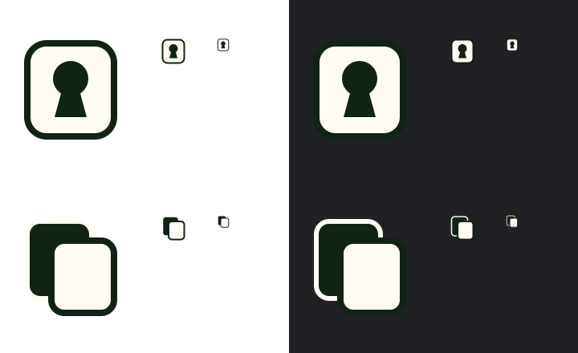

# Favicon design

The selected design is a cream rounded word card with a dark-green keyhole.
The large opening and short tapered stem suggest hidden roles without lettering
or fine detail. The dark outline keeps the cream card visible on light browser
chrome; the cream card contrasts with dark chrome.

Colors are the sRGB equivalents of the app's `--card` (`#fffcf3`) and
`--ink-green` (`#112315`) tokens, clipped to the sRGB gamut.



Each row shows an enlarged 128px preview, then actual 32px and 16px previews,
on white (left) and dark browser chrome (right). View the image at its native
720×440 resolution to assess the small sizes.

The alternative, [overlapping cards](overlapping-cards.svg), uses a solid green
back card and a cream front card. It conveys concealed cards, but its overlap
is less distinctive at 16px than the keyhole. It is included for review only.

## Assets

- `app/icon.svg` is the lightweight vector master.
- `app/favicon.ico` contains 16×16 and 32×32 RGBA PNG entries in an ICO container.
- `app/apple-icon.png` is a 180×180 rendering on an opaque cream canvas for iOS.

Next.js App Router discovers these files and emits their icon links. The layout
does not add separate icon metadata. Raster assets were rendered from the SVG
using Sharp 0.34.5 at 384 DPI, resized to their target dimensions. The ICO
directory records both sizes with 32-bit color depth.

## Deployment verification

The Playwright icon test checks the generated declarations, HTTP status,
content types, ICO directory and embedded PNG dimensions, and Apple PNG
dimensions. It can also run against a deployed preview or production:

```sh
PLAYWRIGHT_BASE_URL=https://your-deployment.example pnpm exec playwright test e2e/icons.spec.ts --project=chromium
```

On each deployment, open the home page in a fresh browser tab and confirm the
keyhole card appears in the tab. Check the generated icon links in the page
head and open each URL directly; `/favicon.ico` must return an image rather
than an HTML fallback. A previous favicon may remain cached in existing tabs.
Production verification of this change requires deployment after merge.
