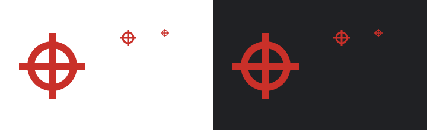

# Favicon design

The selected design is a red crosshair matching the app's existing `⌖` brand
mark. A circle and crossing lines reproduce the mark as vector geometry,
without depending on a browser's font. Thick strokes preserve the shape at
16px, with a transparent background for browser tabs.

The red is the sRGB equivalent of the app's `--accent` (`#c93029`). The Apple
touch icon uses the app's cream `--card` (`#fffcf3`), clipped to the sRGB gamut,
as its opaque background.



The image shows an enlarged 128px preview, then actual 32px and 16px previews,
on white (left) and dark browser chrome (right). View the image at its native
720×220 resolution to assess the small sizes. The crosshair replaces the
initial keyhole-card proposal at the user's request.

## Assets

- `app/icon.svg` is the lightweight vector master.
- `app/favicon.ico` contains 16×16 and 32×32 RGBA PNG entries in an ICO container.
- `app/apple-icon.png` is a 180×180 rendering on an opaque cream canvas for iOS.

Next.js App Router discovers these files and emits their icon links. The layout
does not add separate icon metadata. Raster assets were rendered from the SVG
using Sharp 0.34.5 at 384 DPI, resized to their target dimensions. The ICO
directory records both sizes with 32-bit color depth.

## Deployment verification

The Playwright icon test checks the generated declarations, HTTP status,
content types, ICO directory and embedded PNG dimensions, and Apple PNG
dimensions. It can also run against a deployed preview or production:

```sh
PLAYWRIGHT_BASE_URL=https://your-deployment.example pnpm exec playwright test e2e/icons.spec.ts --project=chromium
```

On each deployment, open the home page in a fresh browser tab and confirm the
red crosshair appears in the tab. Check the generated icon links in the page
head and open each URL directly; `/favicon.ico` must return an image rather
than an HTML fallback. A previous favicon may remain cached in existing tabs.
Production verification of this change requires deployment after merge.
Vercel verification is waived for this PR at the user's request.
